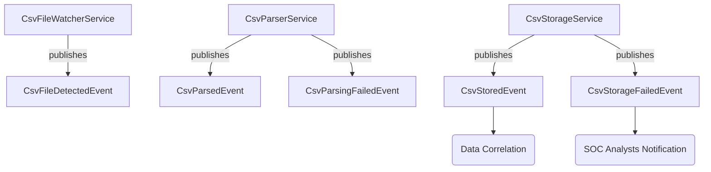

# 📑 CSV Ingestion Module Documentation

## Module: CsvIngestionModule  
**Location:** `com.yosri.defensy.backend.modules.ingestion`

---

## 🎯 Overview

The CSV Ingestion Module is designed to continuously ingest, parse, validate, and store CSV alert data provided by Microsoft Sentinel. It integrates seamlessly with Elasticsearch for storage and provides robust error-handling mechanisms to ensure resilience and reliability. It operates in an event-driven manner, broadcasting events to other modules (e.g., Data Correlation, SOC Analysts notifications).

---

## 🛠️ Features

- Automated CSV ingestion from a monitored directory (`csv-inbox`).
- Data parsing and validation before storage.
- Storage of parsed CSV data into Elasticsearch.
- Error handling and recovery, including moving failed CSV files to dedicated folders.
- Event-driven notifications on successes and failures, enabling other modules to respond accordingly.

---

## 🧩 Architecture

The CSV Ingestion Module follows the modular design principles provided by **Spring Boot Modulith**. The following main components encapsulate the ingestion logic clearly:

| Component                | Responsibility |
|--------------------------|---------------|
| `CsvFileWatcherService`  | Continuously scans and detects new CSV files in the `csv-inbox` directory. |
| `CsvParserService`       | Parses and validates CSV file contents, converting them to structured data objects. |
| `CsvStorageService`      | Stores parsed CSV data into Elasticsearch, handles storage failures, and moves files accordingly. |
| `CsvIngestionRecord`     | Domain object representing CSV entries stored in Elasticsearch. |
| **Event Classes (`event.*`)** | Defines application events triggered during ingestion, parsing, storage successes, and failures. |

---

## 🗂 Directory Structure

```plaintext
ingestion/
├── domain/
│   └── CsvIngestionRecord.java
│
├── event/
│   ├── CsvFileDetectedEvent.java
│   ├── CsvParsedEvent.java
│   ├── CsvParsingFailedEvent.java
│   ├── CsvStoredEvent.java
│   └── CsvStorageFailedEvent.java
│
├── exception/
│   └── CsvParsingException.java
│
├── repository/
│   └── CsvIngestionRepository.java
│
└── service/
    ├── CsvFileWatcherService.java
    ├── CsvParserService.java
    ├── CsvParserServiceImpl.java
    ├── CsvStorageService.java
    └── CsvStorageServiceImpl.java
```

---

## 📌 Event Flow

The module leverages events for communication across components and modules:



---

## ⚙️ Configuration Properties

Module-specific configuration properties can be set in the Spring Boot `application.properties` file or environment variables:

| Property | Default Value | Description |
|----------|--------------|-------------|
| `csv.inbox.dir` | `csv-inbox` | Directory for incoming CSV files |
| `csv.failed.parsing.dir` | `csv-failed-parsing` | Directory for CSV files that fail during parsing |
| `csv.failed.storage.dir` | `csv-failed-storing` | Directory for CSV files that fail during storage |
| `csv.processed.dir` | `csv-processed` | Directory for successfully processed CSV files |

---

## 🚩 Error Handling Strategy

- **Parsing Failure:** Files are moved to `csv-failed-parsing`. `CsvParsingFailedEvent` is triggered.
- **Storage Failure:** Files are moved to `csv-failed-storing`. `CsvStorageFailedEvent` is triggered.
- **Critical Issues:** Logged extensively and alerts sent to SOC Analysts via the notification module.

---

## ✅ Testing Strategy

Module components are tested using **Mockito** to simulate dependencies and interactions:

| Test Class | Purpose |
|------------|---------|
| `CsvParserServiceTest` | Ensures CSV parsing accuracy and event publication. |
| `CsvStorageServiceTest` | Verifies storage, file-moving, and failure event logic. |

---

## 🛡️ Security and Best Practices

- **Input validation and sanitation** (SonarQube recommended practices).
- **Event-driven architecture** for decoupled, maintainable, and scalable design.
- **Secure file handling** to avoid path traversal vulnerabilities (Snyk guidelines).
- **Clear, informative logging and auditing** for all critical actions.

---

## ☁️ Deployment Considerations

- For **Azure or cloud container deployments**, ensure all paths (`csv-inbox`, `csv-failed-storing`, etc.) are properly configured via environment variables or `application.properties`.
- **Persistent storage** (Azure Files, Blob Storage, etc.) recommended for stateful file storage.

---

## 📌 Future Improvements

- Enhanced parsing error diagnostics.
- Adaptive ingestion strategies based on **Elasticsearch load and performance metrics**.
- Improved monitoring and **metrics integration**.

---

## 🚨 Troubleshooting

| Issue | Possible Causes | Resolution |
|--------|----------------|------------|
| Files not processed | Incorrect file paths or permissions | Verify paths in configuration and file permissions |
| Storage failure events frequent | Elasticsearch downtime or overload | Check Elasticsearch cluster health and load |
| Failed file not moved properly | File-system permissions or missing folders | Ensure correct directory permissions & existence |

---

📅 **Document Last Updated:** 2025-03-09
